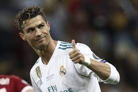

# Cristiano Ronaldo: La carrera del mejor jugador del mundo


Cristiano Ronaldo es sin duda uno de los mejores futbolistas de todos los tiempos. Nació en Funchal, Madeira, Portugal, el 5 de febrero de 1985, y desde muy joven demostró su pasión por el fútbol y su talento innato para jugarlo. Con el tiempo, se ha convertido en un referente del deporte a nivel mundial, y es admirado tanto por su habilidad en el campo como por su dedicación y disciplina fuera de él.

## Inicios en el fútbol

A los ocho años, Ronaldo comenzó a jugar en las categorías inferiores del Andorinha, un club de su ciudad natal. Más tarde, pasó a formar parte del Nacional de Madeira, donde tuvo su debut como jugador profesional en 2002, con apenas 17 años.

En 2003, fue fichado por el Sporting de Lisboa, uno de los clubes más importantes de Portugal, donde se destacó por su habilidad, velocidad y capacidad goleadora. En ese mismo año, hizo su debut con la selección portuguesa en un partido amistoso contra Kazajistán.

## Salto al estrellato



En 2003, Ronaldo fue fichado por el Manchester United, uno de los equipos más exitosos de Inglaterra. Allí, bajo la dirección técnica de Sir Alex Ferguson, se convirtió en uno de los jugadores más importantes del equipo y del fútbol mundial.

En el Manchester United, Ronaldo ganó tres títulos de la Premier League, una Liga de Campeones de la UEFA y un Mundial de Clubes. También recibió numerosos premios individuales, como el Balón de Oro de 2008.

En 2009, Ronaldo fichó por el Real Madrid, uno de los clubes más importantes de España y del mundo. En el Real Madrid, Ronaldo alcanzó su máxima expresión como futbolista, marcando una cantidad impresionante de goles y ganando varios títulos importantes, como cuatro Ligas de Campeones de la UEFA. Con el Real Madrid, también consiguió su quinto Balón de Oro en 2017.

En 2018, Ronaldo fichó por la Juventus de Turín, uno de los equipos más importantes de Italia. Con la Juventus, ha seguido cosechando éxitos y ha demostrado que, a pesar de su edad, sigue siendo uno de los mejores jugadores del mundo.

### Historia de Cristiano Ronaldo con Portugal

Cristiano Ronaldo debutó con Portugal en 2003, convirtiéndose rápidamente en una figura clave en la selección. A lo largo de los años, ha demostrado su habilidad, su liderazgo y su pasión por su país en cada partido que juega con la selección.

En los primeros años de su carrera internacional, Ronaldo fue criticado por su falta de efectividad con la selección y por su actitud en el campo. Pero con el tiempo, Ronaldo demostró su valía y se convirtió en el líder y capitán indiscutible de Portugal.

Uno de los momentos más importantes en la historia de Cristiano Ronaldo con Portugal fue en la Eurocopa de 2016. Después de una fase de grupos complicada, Portugal logró avanzar a las rondas eliminatorias gracias a un gol de Ronaldo en el partido contra Hungría. En los octavos de final, Ronaldo tuvo que abandonar el campo debido a una lesión en la rodilla, pero su presencia en el banquillo y su liderazgo desde fuera del campo ayudaron a Portugal a superar a Croacia y Polonia en los cuartos de final y semifinales, respectivamente. En la final contra Francia, Ronaldo tuvo que abandonar el campo nuevamente debido a una lesión, pero una vez más, su liderazgo desde fuera del campo inspiró a sus compañeros a luchar por la victoria. Portugal finalmente ganó la Eurocopa por primera vez en su historia, y Ronaldo se convirtió en el héroe nacional.

En la Copa del Mundo de 2018, Ronaldo tuvo un desempeño impresionante, anotando cuatro goles en los cuatro partidos que Portugal jugó antes de ser eliminado por Uruguay en octavos de final. A pesar de la decepcionante salida de Portugal del torneo, Ronaldo demostró una vez más su capacidad para liderar y ser un jugador clave en su selección.

En resumen, la historia de Cristiano Ronaldo con la selección portuguesa es una de las más destacadas en la historia del fútbol. Ronaldo se ha convertido en un icono del fútbol portugués y un héroe nacional, con varios títulos y goles importantes en su haber.```


